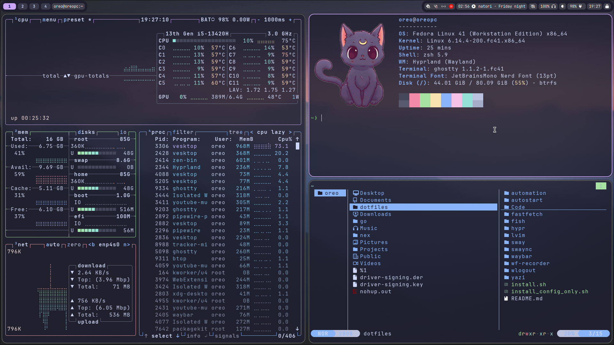

# Miguel's dotfiles repo



## Installation

To install everything, just do:

```bash
chmod +x install.sh && ./install.sh
```

It will install all needed packages for the scripts to work, nothing more.

You must be on an Arch-based distribution for this configuration to work. I may adapt it to other distros later.
